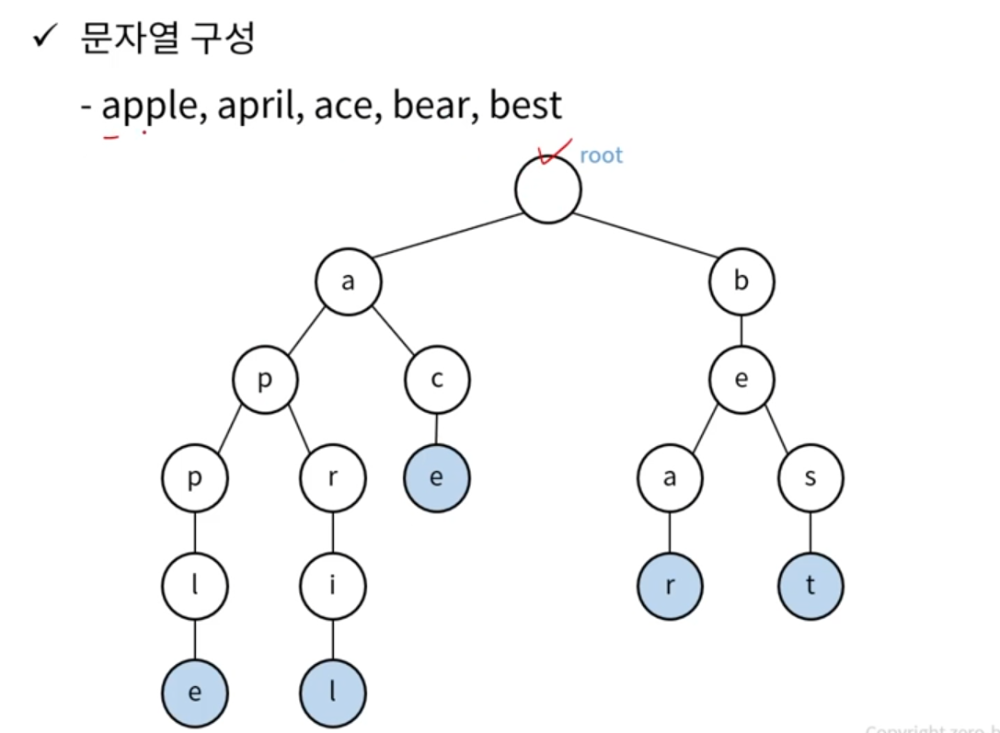

> 트라이 (Trie)
- 문자열을 저장하고 빠르게 탐색하기 위한 트리 형태의 자료 구조
- 정렬된 트리 구조
- 문자열 저장을 위한 메모리가 필요하지만 탐색이 빠름
- 길이가 N인 문자열의 탐색 시간 복잡도 : O(N)
- 생성 복잡도 O(MN) / M : 문자열의 개수

> 트라이 형태
* 

> 트라이 구현
- Key, Value 로 이루어진 노드 구성
  - Key : 알파벳
  - Value : 자식 노드
    - class Node{ 
    HashMap<Character, Node> child; 
    boolean isTerminal;} //파란색 True, 흰색 False