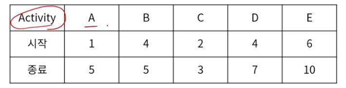
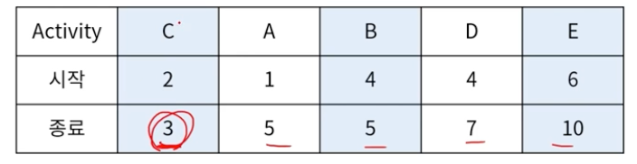
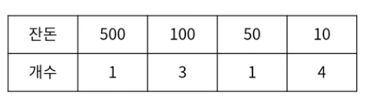
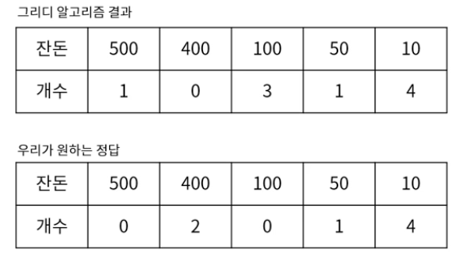

> 그리디 알고리즘 (Greedy Algorithm)
- 매 순간 현재 기준으로 최선의 답을 선택해 나가는 기법
  - 빠르게 근사치를 계산할 수 있다.
  - 결과적으로는 최적해가 아닐 수도 있다.

> 그리디 알고리즘 예시_1
- Activity Selection Problem
  - N개의 활동과 각 활동의 시작/종료 시간이 주어졌을 때,  한 사람이 최대한 많이 할 수 있는 활동의 수 구하기 
  
  - 종료 시간 기준으로 정렬
  - 👉먼저 종료되는 활동 순 겹치지 않는 순으로 선택 
  

> 그리디 알고리즘 예시_2
- 거스름돈 (동전의 개수 가장 적게)
  - 잔돈 : 890
  - 동전 종류 : 10,50,100,500
  - 👉큰 동전부터 계산 
   
  

> 그리디 알고리즘 적용 조건
- 그리디 알고리즘은 빠르지만 최적해를 보장하지는 못함
- 하기 두 가지 조건에 해당하는 경우 적용 가능
  - 탐욕적 선택 특성 (Greedy choice property) 
  지금 선택이 다음 선택에 영향을 주지 않음
  - 최적 부분 구조 (Optimal substructure) 
  전체 문제의 최적해는 부분 문제의 최적해로 이루어짐